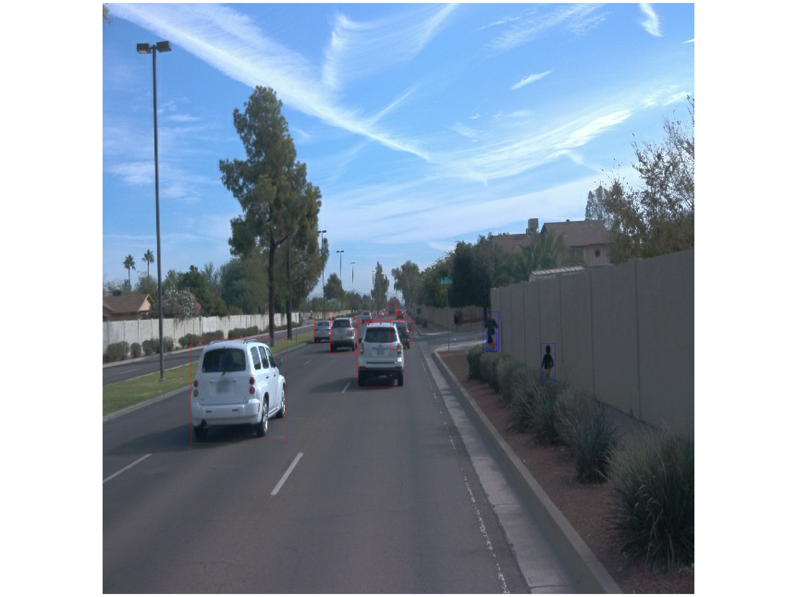
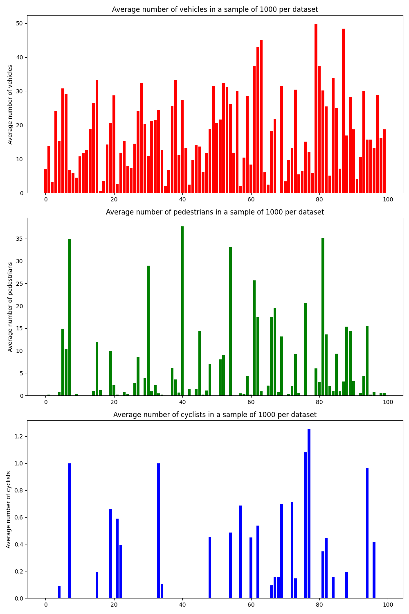
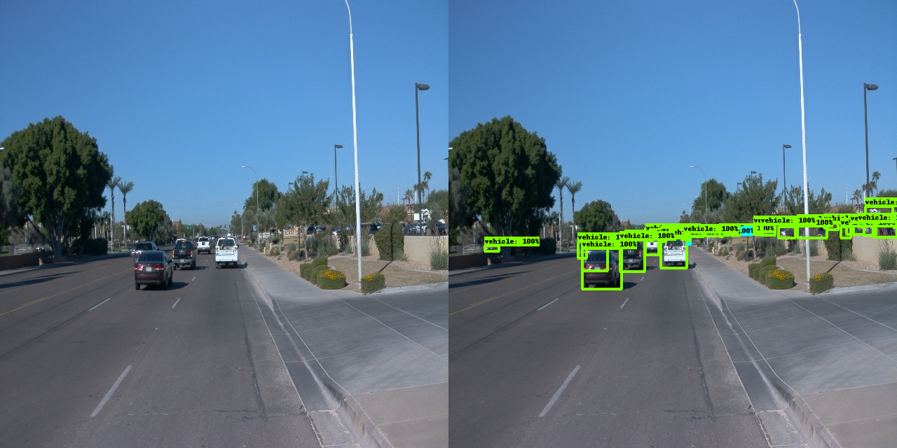
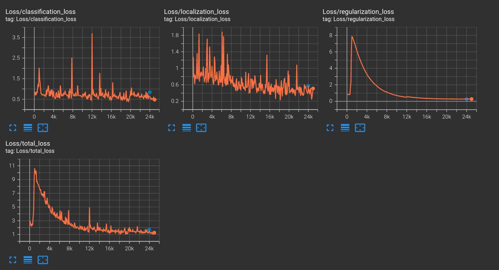
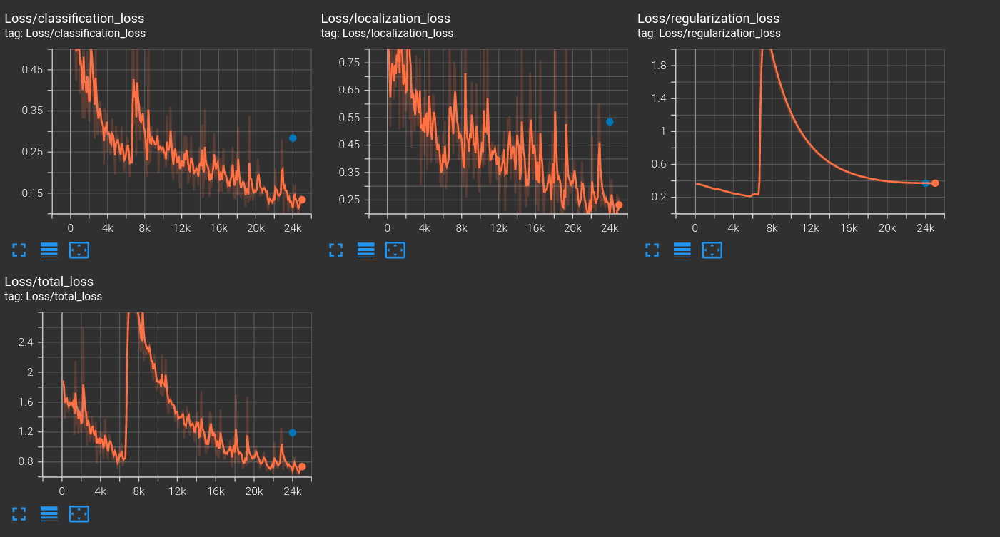
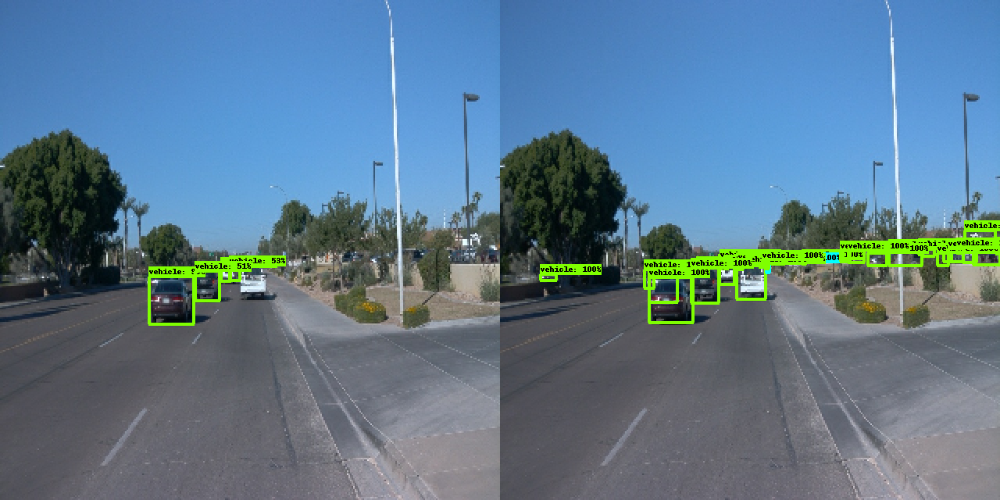
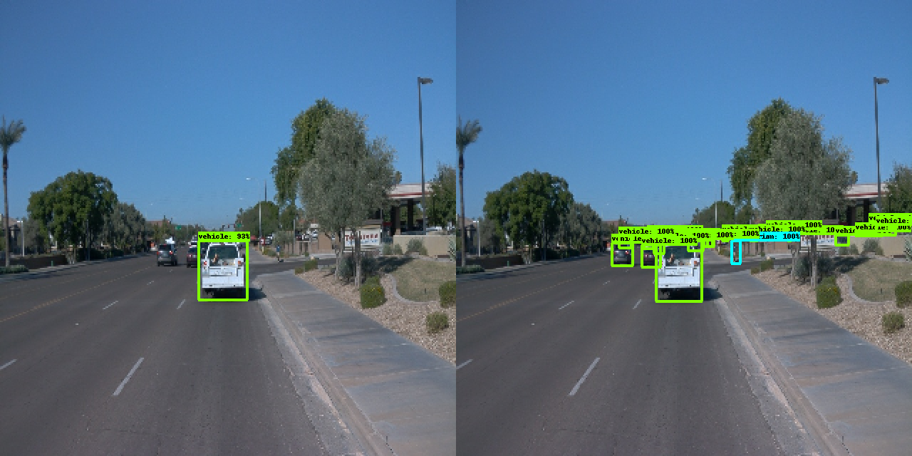
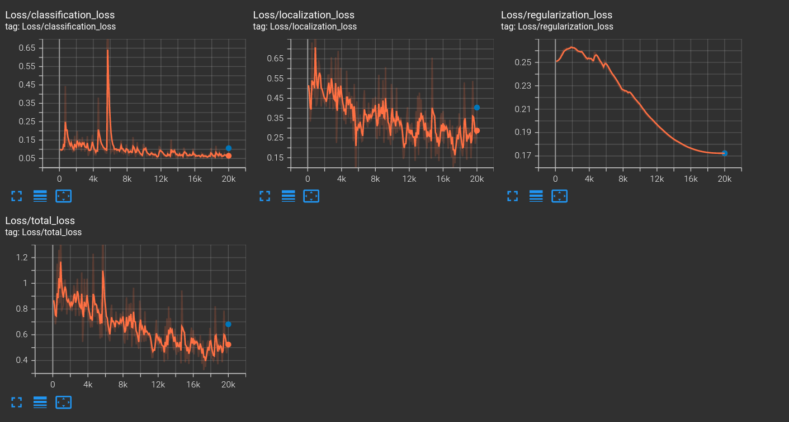
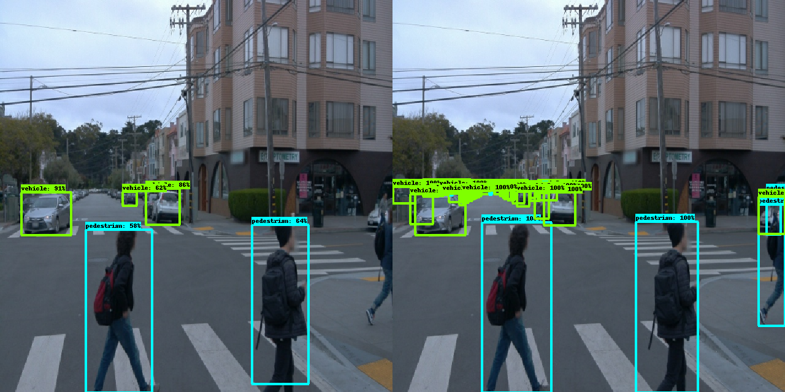

# **Project overview**

This project aims to train a Convolutional Neural Network capable of detecting vehicles, cyclists and pedestrians in camera images. This is a crucial function for self-driving cars, as it classifies objects in the surroundings of the ego vehicle, which helps in motion planning and collision avoidance,

## **Set up**
1. This project was tested using with Nvidia Driver 470.239.06 and CUDA 11.4 on an Ubutun 20.04 machine. Please update the versions in the Dockerfile to match your setup.
2. Build the Docker image with
```
cd .devcontainer && docker build -t udacity-self-driving-vision-proj -f Dockerfile .
```
2. Run the Docker container
```
docker run --gpus all -v <PATH TO LOCAL PROJECT FOLDER>:/app/project/ --network=host -ti udacity-self-driving-vision-proj bash
```
or start a Devcontainer in VSCode using the devcontainer.json file

3. Run the inference with the final model and generate an animation GIF
```
cd .. && python inference_video.py --labelmap_path label_map.pbtxt --model_path experiments/final_model/exported/saved_model --tf_record_path <Path to .tfrecord> --config_path experiments/final_model/pipeline_new.config --output_path experiments/final_model/animation.gif 
```
4. Check the training and validation results of any of the provided models under experiments using 
```
 python -m tensorboard.main --logdir experiments/<Folder containing the training logs>
```

# **Data analysis**

The dataset used in this project is part of the Waymo Open Dataset. The data consists of recordings from a front-facing camera in urban scenarios:



The dataset includes ground truth labels for vehicles, cyclists and pedestrians. It also includes images at night and in varying weather conditions, such as rain:


The class distribution was analyzed by determining the average number of occurances of each class in a 1000 random images from each data set. The results are shown below.



In order to make sure that the model performs well under different light and weather conditions, the dataset was split into the training, validation and testing datasets so that each set includes the same ratio of normal, dark and blurry images. For example, if the data should be split in a 70:20:10 ratio, then 70% of the bright, dark and blurry images will be sorted into the training set, 20% into the validation set and 10 into the testing set.

This was done by analyzing the image intensity and blur across the entire dataset using a random image from each .tfrecord (see the Exploratory Data Analysis notebook). The perceived image intensity was used as an indication of the image brightness and, in order to detect blurry images, the Laplacian filter was applied to each image to detect edges and the variance of the resulting image was used to determine the degree of image blur. The lower the variance is, the blurrier the image is. After determining the image intensity and Laplacian variance over the entire dataset, the standard deviation of each metric was calculated and the images scoring below a configurable lower limit (a multiple of the standard deviation) are marked as dark or blurry. The results are shown in the graphs below


In the Exploratory Data Analysis notebook, the generate_split_cfg() function analyzes the image intensity and blur as described above and generates a YAML file containing the file paths that should be used for training, evaluation and testing. This file can then be fed into the create_splits.py so that the files are restructured accordingly.

# **Training**
## *Reference experiment*

In all of the experiments, 85% of the data was used to train the model, 10% was used for evaluation and 5% was reserved for testing. The first training attempt clearly failed, as the trained model failed to detect any objects from the evaluation dataset, as shown in the example below:



By looking at the training metrics, it can be seen that the loss, especially the classification loss, flactuates and even explodes around the 12000th iteration. While the localization loss decreases slightly, the classification loss barely converges and only drops to around 0.48 from the initial 0.68. The precision and recall values are almost 0 (1.94e-3), which explains why none of the objects was detected. This problem might have multiple reasons, such as:
1. The batch size is too small: small batch sizes can introduce a lot of noise and instability in the loss function.
2. The learning rate is too high: a high learning rate leads to large updates to the weights, causing the model to potentially overshoot to a local minimum



# **Model Improvements**
## *Experiment 0*
In the first attempt to improve the performance of the model, the batch size was increased to 4 and the image size was halved, in order to be able to train the model due to the limitation of the hardware available.
The higher batch size should enable the model to generalize more and avoid converging to a local minimum. 

The training loss looks significantly better. The classification loss and total loss reach 0.13 and 0.8 as opposed to 0.48 and 1.3 in the reference experiment, respectively. The recall and precision values have also improved to 0.022 and 0.06, respectively, indicating a low number of false positives but with a high amount of missed detections or false negatives. Moreover, the evaluation loss is higher than the training loss at 1.19 (total loss) indicating that the model is overfitting. 





The model also seems to be performing worse under dark lighting cocnditions


It is also worth noting that the model struggles to detect pedestrians more than vehicles and fails to detect smaller objects such as vehicles further away, as shown in the example below



## *Experiment 1*

In the next experiment, the batch size was reduced back to 2 and the image size was increased back to 480x480 in order to avoid losing details in the image while attempting to avoid overfitting by using data augmentation and by decreasing the number of iterations to 20000 instead of 25000. For data augmentation, the random brightness and random downscale augemnation functions were used in order to mimic darkness and blurriness, respectively. The momentum of the optimizer was deacreased slightly to avoid overshooting. In addition, the number of scales used in Feature Pramid Network was increased and additional anchor boxes of higher aspect ratios were added, in order to detect more objects of smaller sizes. Furthermore, the gamma parameter of the weighted sigmoid classification loss function was increased in order to counteract the class distribution imbalance and so that the model focuses more on the harder examples in the dataset.

The loss values improved significantly, reaching 0.06 for the classification loss and 0.68 for the total loss. Moreover, the precision increased to 0.12 and the recall increased to 0.05. 





The model now detects pedestrians and smaller objects more reliably and performs slightly better under dark conditions as shown in the examples below


However, the evaluation loss is still higher than the training loss and the precision and recall values are quite low. The model still misses some detections and the localization error is quite high. Increasing the batch size and increasing the image size while using more capable hardware might already yield better results.